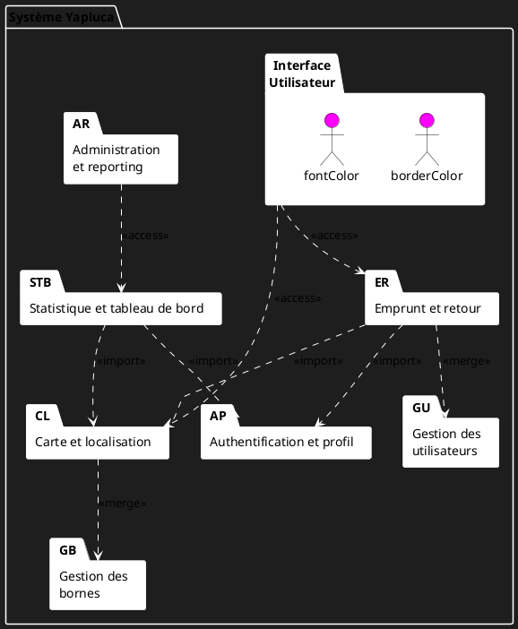

# Diagramme de Packages Visual - YapluCa

## Description du Diagramme

Ce document décrit un diagramme de packages UML pour l'application YapluCa, montrant les packages principaux, les sous-packages et leurs relations.

## Structure des Packages

### Packages Principaux
1. **Interface Utilisateur** - Gère l'expérience utilisateur et l'interface graphique
2. **Gestion des Bornes** - Gère tout ce qui concerne les bornes de recharge
3. **Gestion des Utilisateurs** - Gère les fonctionnalités liées aux utilisateurs
4. **Administration et Reporting** - Fonctionnalités pour les administrateurs

### Sous-Packages
1. **Authentification et Profil** - Gère l'authentification et les profils utilisateurs
2. **Carte et Localisation** - Gère l'affichage des bornes et la géolocalisation
3. **Emprunt et Retour** - Gère les emprunts et retours de batteries
4. **Statistique et Tableau de Bord** - Gère les statistiques et rapports

## Relations entre Packages

### Relations d'Import (<<import>>)
- **Emprunt et Retour** importe **Authentification et Profil**
- **Emprunt et Retour** importe **Carte et Localisation**
- **Statistique et Tableau de Bord** importe **Authentification et Profil**
- **Statistique et Tableau de Bord** importe **Carte et Localisation**

### Relations d'Accès (<<access>>)
- **Interface Utilisateur** accède à **Emprunt et Retour**
- **Interface Utilisateur** accède à **Carte et Localisation**
- **Administration et Reporting** accède à **Statistique et Tableau de Bord**

### Relations de Fusion (<<merge>>)
- **Emprunt et Retour** fusionne vers **Gestion des Utilisateurs**
- **Carte et Localisation** fusionne vers **Gestion des Bornes**

## Code PlantUML

Voici le code PlantUML pour générer un diagramme similaire à l'image partagée:

## Instructions pour Générer le Diagramme

1. Copiez le code PlantUML ci-dessus
2. Utilisez un outil en ligne comme [PlantUML Web Server](http://www.plantuml.com/plantuml/uml/) ou [PlantText](https://www.planttext.com/)
3. Collez le code et générez le diagramme
4. Téléchargez l'image générée

Alternativement, vous pouvez utiliser des outils comme Draw.io ou Lucidchart pour créer manuellement un diagramme similaire.

## Exemple de Rendu

Le diagramme généré devrait ressembler à l'image que vous avez partagée, avec:

- Un fond sombre
- Des packages représentés par des rectangles avec des bordures blanches
- Des packages principaux en haut et des sous-packages en bas
- Des flèches en pointillés montrant les relations entre packages
- Des stéréotypes UML (<<import>>, <<access>>, <<merge>>) sur les flèches
- Des couleurs différentes pour chaque type de package (Interface Utilisateur, Gestion des Bornes, etc.)

Ce diagramme offre une vue claire de l'architecture de l'application YapluCa, montrant comment les différents packages interagissent entre eux.
